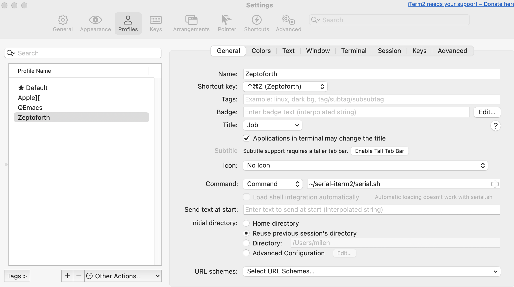
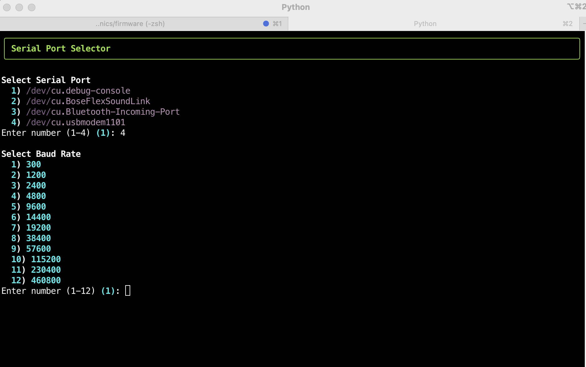
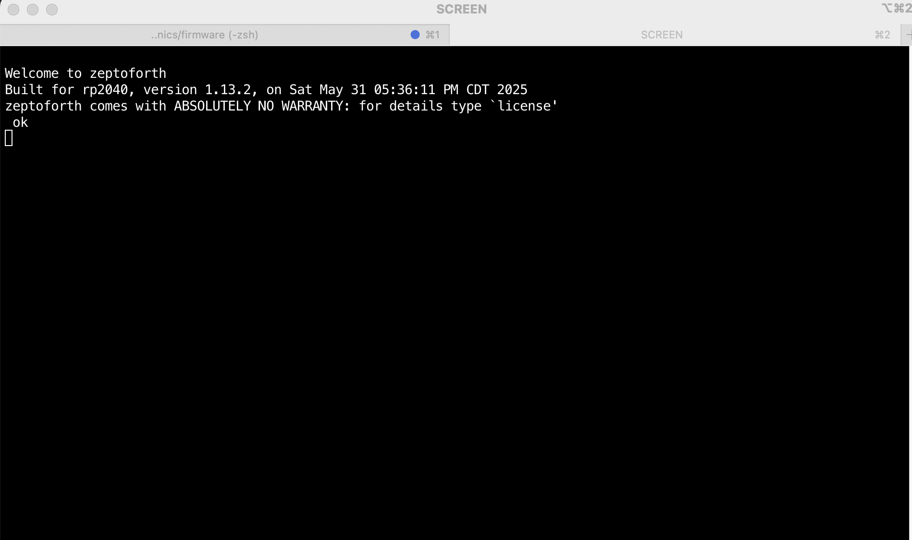

# Serial console with iTerm2

There is no free decent serial app for MacOS, but we do have `screen`, so why not automate a bit using it with iTerm2?
You could log in manually into the serial console, but it's tedious to look up the name of the serial device every time you connect to it. This script will automate this for you and will start the serial console in iTerm.

### Requirements

We are going to use Python. Clone the repository to your home directory:

``` git clone git@github.com:varna9000/serial-iterm2.git ```


Seetup the virtual environment and install python dependencies:

```
cd ~/serial-iterm2
python3 -m venv .venv
source .venv/bin/activate
python3 -m pip install -r requirements.txt
```

or if you have `uv`:

```
cd ~/serial-iterm2
uv venv
source .venv/bin/activate
uv pip install -r requirements.txt
```

Now, create a new profile in your iTerm by going to "Settings -> Profiles" and click on the `+` at the bottom left.
Navigate to the `General` tab in the panel to the right and put `~/serial-iterm2/serial.sh` in the `Command` field

Now you can open the profile from the `Profiles` top menu or use a short cut key if you set one in the `General` tab of the profile.




